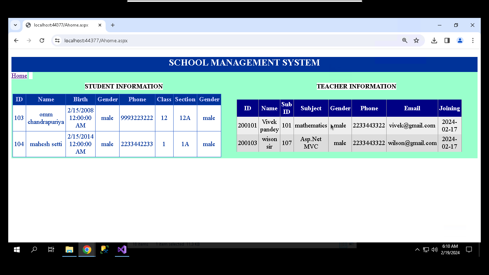

# School-Management-System
### About
The application is helpful for School Management.Here admin can login and access to the main system. Admin can manage students, subjects, teachers, sections, dashboard. Admin can keep record of student information, can keep subject records, can keep all teacher records, can keep section records and view in the dashboard. Technologies used: C#, ASP.Net, ADO.Net. Database: SQL Server

### Technology 
ASP.NET , ADO.NET , C# , Sql Server

### USER INTERFACE
 #### ADMIN LOGIN
 Here admin can login and enter into menu page

 

#### HOME PAGE

#### STUDENTS INFORMATION
Here we register student information and registered student shown in table.

#### SUBJECTS INFORMATION
Here we add subject information which are required for students.

#### TEACHERS INFORMATION
Here we add teachers information based on the subject available in our school.

#### SECTION INFORMATION
Here we add section of students. we add section and class of only those students who are registered in student information.
 when we put student id then if student registered then their name show automatically.

#### DASHBORD
Here admin can see all the students and teachers information of their school.

